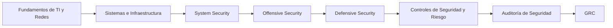

<div align="center">

# Cybersecurity Labs

### Offensive Security · Defensive Security · System Security · Infrastructure Systems · GRC


<br>


<br>

**Laboratorios prácticos de ciberseguridad, documentación técnica y proyectos de infraestructura.**

</div>

---

## Descripción General

**Cybersecurity-Labs** es mi repositorio central para documentar prácticas, laboratorios y proyectos relacionados con ciberseguridad, sistemas e infraestructura.

El contenido está organizado por áreas para separar claramente los diferentes enfoques de trabajo: seguridad ofensiva, seguridad defensiva, hardening de sistemas, infraestructura y GRC.

Cada directorio contiene documentación técnica desarrollada durante laboratorios académicos y prácticas realizadas en entornos controlados.

El repositorio también funciona como un registro de mi evolución técnica y del conocimiento adquirido a medida que avanzo hacia áreas más especializadas de seguridad informática.

---

## Áreas de Seguridad

| Área                                                  | Enfoque                                                             |
| ----------------------------------------------------- | ------------------------------------------------------------------- |
| 🔴 [Offensive Security](./Offensive-Security)         | Pruebas de penetración, explotación, ataques de red y seguridad web |
| 🛡️ [Defensive Security](./Defensive-Security)        | Detección, monitoreo, análisis de logs y respuesta                  |
| 🟣 [System Security](./System-Security)               | Hardening, Windows, Linux, autenticación y vulnerabilidades         |
| 🟠 [Infrastructure Systems](./Infrastructure-Systems) | Linux, servidores, automatización, Docker y servicios de red        |
| 🔵 [GRC](./GRC)                                       | Gobierno, gestión de riesgos, cumplimiento y políticas              |

---

## Arquitectura de Ciberseguridad

```mermaid
flowchart TD

    A["Cybersecurity Labs"]

    A --> B["Offensive Security"]
    A --> C["Defensive Security"]
    A --> D["System Security"]
    A --> E["Infrastructure Systems"]
    A --> F["GRC"]

    B --> B1["Pentesting"]
    B --> B2["Explotación"]
    B --> B3["Seguridad Web"]
    B --> B4["Ataques de Red"]

    C --> C1["Monitoreo"]
    C --> C2["Detección"]
    C --> C3["Respuesta a Incidentes"]

    D --> D1["Seguridad en Windows"]
    D --> D2["Hardening de Linux"]
    D --> D3["Seguridad de Identidad"]
    D --> D4["Evaluación de Vulnerabilidades"]

    E --> E1["Linux"]
    E --> E2["Docker"]
    E --> E3["Ansible"]
    E --> E4["Servicios de Red"]

    F --> F1["Gobierno"]
    F --> F2["Gestión de Riesgos"]
    F --> F3["Políticas"]
    F --> F4["Cumplimiento"]
```



---

# Directorio de Laboratorios

## Offensive Security

> Pruebas de Penetración · Explotación · Ethical Hacking

Prácticas enfocadas en comprender técnicas ofensivas utilizadas durante evaluaciones de seguridad dentro de entornos controlados.

```text
[+] Denegación de Servicio
[+] Fuerza Bruta SSH
[+] Explotación de Windows
[+] Técnicas con Archivos Maliciosos
[+] Kali Linux
[+] Pruebas de Penetración
```

➡️ **[Explorar Offensive Security](./Offensive-Security)**

---

## System Security

> Hardening · Configuración Segura · Evaluación de Vulnerabilidades

Laboratorios enfocados en protección de sistemas operativos, controles de seguridad y evaluación de configuraciones.

```text
[+] BitLocker
[+] Seguridad NTLM
[+] Microsoft Credential Guard
[+] Microsoft LAPS
[+] Hardening de Linux
[+] ClamAV
[+] DNSSEC
[+] Nessus
[+] OpenSCAP
[+] Windows Server
```

➡️ **[Explorar System Security](./System-Security)**

---

## Infrastructure Systems

> Linux · Servidores · Automatización · Alta Disponibilidad

Prácticas de administración de sistemas e infraestructura utilizadas como base para diferentes escenarios de seguridad.

```text
[+] Ubuntu Server
[+] Ubuntu Desktop
[+] Docker
[+] Ansible
[+] DNS
[+] DHCP
[+] Samba Active Directory
[+] Alta Disponibilidad con Apache
[+] Administración de Servidores
```

➡️ **[Explorar Infrastructure Systems](./Infrastructure-Systems)**

---

## GRC

> Gobierno · Gestión de Riesgos · Cumplimiento

Documentación relacionada con gobierno de seguridad, gestión de riesgos, políticas y controles.

```text
[+] NIST Cybersecurity Framework 2.0
[+] Gestión de Riesgos de Ciberseguridad
[+] Políticas de Seguridad
[+] Gestión de Activos
[+] Seguridad de Recursos Humanos
[+] Seguridad Física
[+] Tratamiento de Riesgos
[+] Transferencia de Riesgo Cibernético
```

➡️ **[Explorar GRC](./GRC)**

---

## Defensive Security

> Detección · Monitoreo · Operaciones de Seguridad

Espacio destinado a laboratorios relacionados con operaciones defensivas y análisis de eventos de seguridad.

```text
[*] Monitoreo de Seguridad
[*] SIEM
[*] Análisis de Logs
[*] Detección de Amenazas
[*] Respuesta a Incidentes
[*] Threat Hunting
```

➡️ **[Explorar Defensive Security](./Defensive-Security)**

---

# Tecnologías y Herramientas

## Sistemas Operativos


---

## Infraestructura y Automatización


---

## Servicios de Red y Servidor


---

## Offensive Security


---

## System Security y Hardening


---

## GRC — Gobierno, Riesgo y Cumplimiento


---

# Estructura del Repositorio

```text
Cybersecurity-Labs/
│
├── Offensive-Security/
│   ├── Pruebas de Penetración
│   ├── Explotación
│   ├── Ataques de Red
│   └── README.md
│
├── Defensive-Security/
│   └── README.md
│
├── System-Security/
│   ├── Seguridad Windows
│   ├── Seguridad Linux
│   ├── Hardening
│   ├── Evaluación de Vulnerabilidades
│   └── README.md
│
├── Infrastructure-Systems/
│   ├── Linux
│   ├── Docker
│   ├── Ansible
│   ├── Servicios de Red
│   └── README.md
│
├── GRC/
│   ├── Gobierno
│   ├── Gestión de Riesgos
│   ├── Políticas
│   ├── Cumplimiento
│   └── README.md
│
└── README.md
```

---

# Roadmap

La evolución de `Cybersecurity-Labs` está orientada a construir primero una base técnica sólida y utilizar ese conocimiento posteriormente en áreas de **Governance, Risk and Compliance (GRC)**.



### Áreas Actuales

```text
Infraestructura y Sistemas
        │
        ├── Administración de Linux
        ├── Windows Server
        ├── Redes
        ├── Docker
        └── Ansible

System Security
        │
        ├── Seguridad Windows
        ├── Hardening de Linux
        ├── Evaluación de Vulnerabilidades
        └── Protección de Identidad

Offensive Security
        │
        ├── Pentesting
        ├── Seguridad Web
        ├── Ataques de Red
        └── Explotación

       GRC
        │
        ├── Gobierno
        ├── Gestión de Riesgos
        ├── Políticas de Seguridad
        ├── Auditoría
        └── Cumplimiento
```

---

# Documentación

Los laboratorios pueden incluir diferentes tipos de evidencia dependiendo de la práctica:

<details>

<summary><strong>Documentación Técnica</strong></summary>

<br>

* Objetivo del laboratorio
* Escenario utilizado
* Arquitectura
* Configuración
* Comandos
* Evidencias
* Resultados
* Problemas encontrados
* Soluciones aplicadas
* Análisis técnico

</details>

<details>

<summary><strong>Entorno de Laboratorio</strong></summary>

<br>

Los ejercicios son realizados utilizando diferentes entornos controlados:

* Máquinas virtuales
* Sistemas Windows y Linux
* Servidores
* Aplicaciones vulnerables
* Infraestructura de laboratorio
* Plataformas académicas
* Entornos de prueba

</details>

---

## Uso Responsable

Todo el contenido relacionado con seguridad ofensiva tiene fines **educativos, académicos y de investigación**.

Las técnicas documentadas son ejecutadas únicamente sobre sistemas propios, laboratorios autorizados o entornos específicamente diseñados para pruebas de seguridad.

---

<div align="center">

## Autor

<strong>Víctor José Santos Guzmán</strong>

<sub>Seguridad Informática · Cybersecurity Labs</sub>

<a href="https://github.com/victorjs-g">GitHub</a>
 ·  <a href="https://www.linkedin.com/in/victorjs-g/">LinkedIn</a>

<br><br>

---

### Aprender · Construir · Probar · Analizar · Proteger

<sub>Cybersecurity-Labs</sub>

</div>
